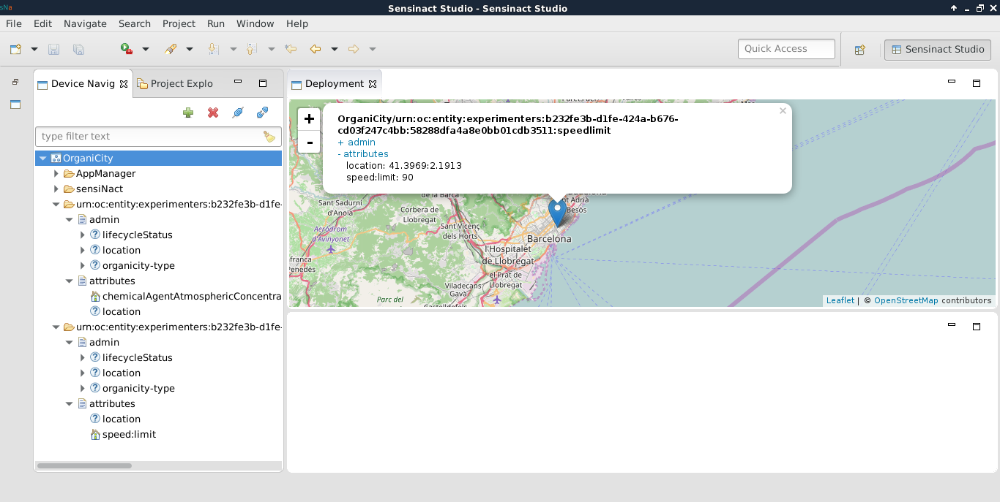
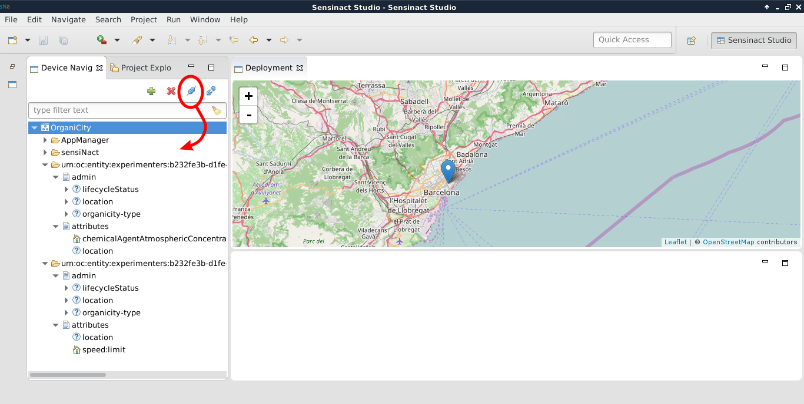
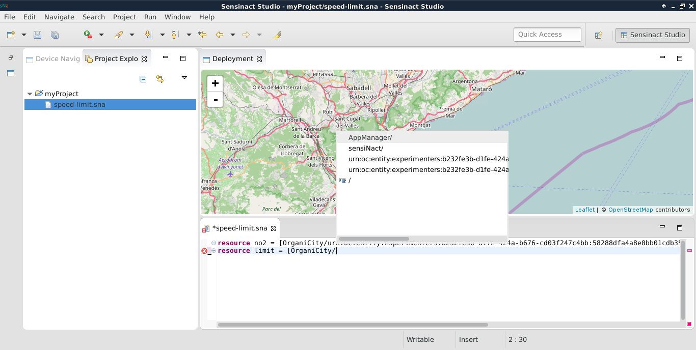
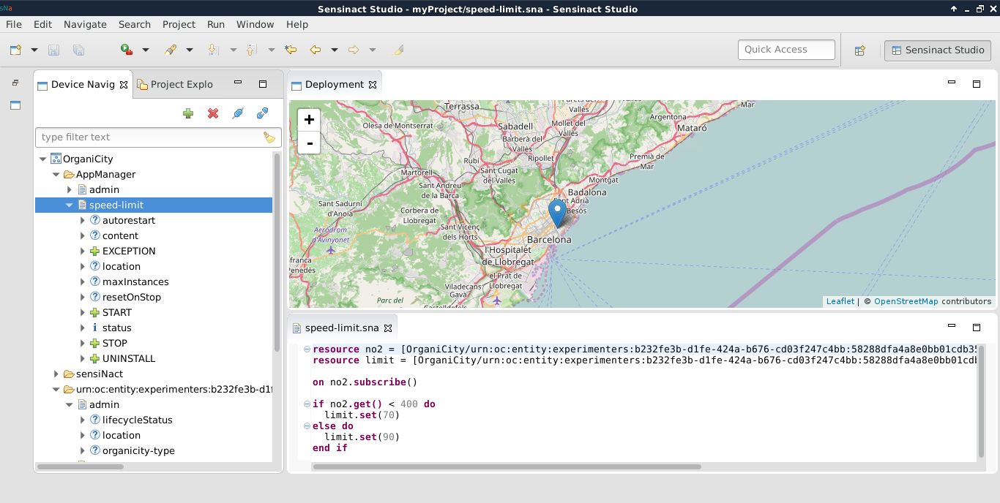
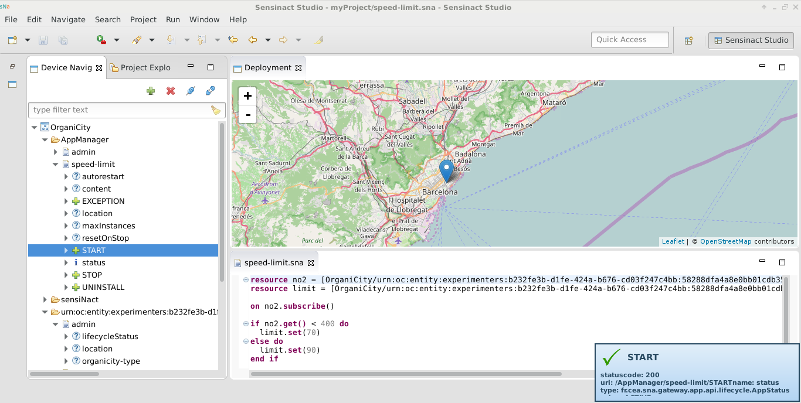
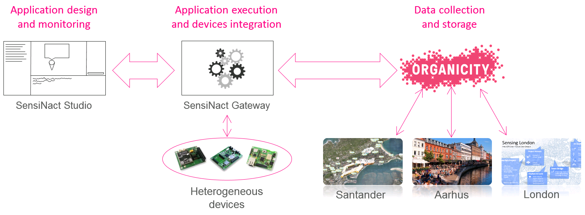
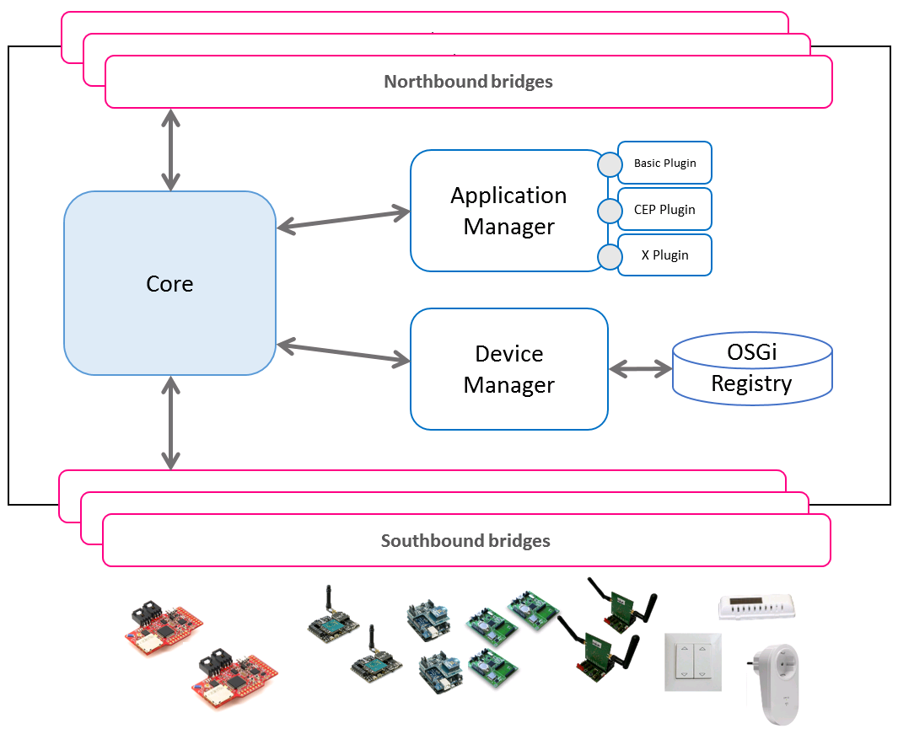
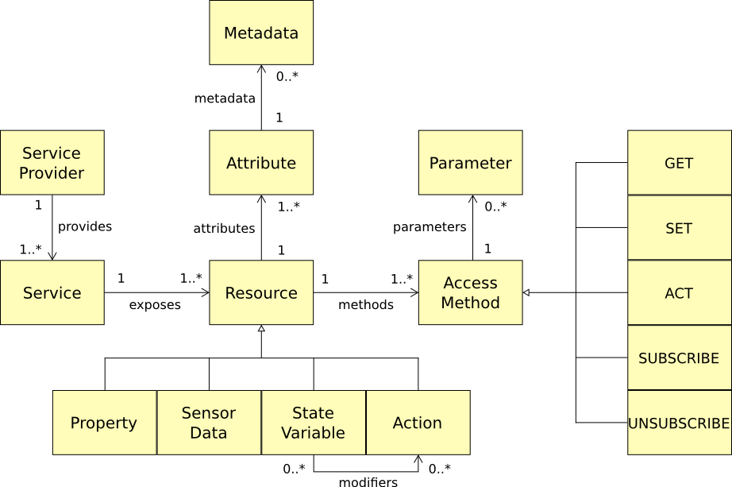

# Eclipse sensiNact

## Introduction

[Eclipse sensiNact](https://projects.eclipse.org/projects/technology.sensinact) aims at helping coders working with data streams from deployed “IoT” devices without the need to complex API configuration.

Using Eclipse sensiNact, experimenters can find Internet of Things devices which are deployed in the city, and understand the data streams that they provide. The Eclipse sensiNact IDE allows the creation of applications using a scripting tool (with Code Assist functionality). These applications might set up alerts for when variables in the data streams reach certain levels, or can aggregate data from many devices, creating virtual devices which provide coarse data that might be more useful to an experiment.

The following schema summaries the way Eclipse sensiNact integrates with the OrganiCity Experimentation as a Service facility.


The Organicity EaaS facility collects and stores data from the federated sites (Santander, Aarhus and London, on this schema). Eclipse sensiNact Gateway is connected to this platform, and is notifed when IoT devices is added, removed, or when sensed data is updated. Eclipse sensiNact studio provides a graphical UI to the gateway. It ease discovering devices, and provides an editor to write applications using IoT devices.


## Installation

To use Eclipse sensiNact, you need a gateway, and the studio. The easier solution is to install both on your onw computer (running Linux 64 bits) with the following procedure. 

First, you will need to add the Eclipse sensiNact repository to `/etc/apt/sources.list` configuration file.

``` bash
echo "deb http://debian.organicity.eu ./" | sudo tee -a /etc/apt/sources.list
```

Then, you can install both studio and gateway.

``` bash
sudo apt-get update --yes
sudo apt-get install --yes sensinact
sudo apt-get install --yes sensinact-studio
```

## Configuration

Because Eclipse sensiNact is a modular runtime, you will need to choose the parts (bundles) you want to have up and running.

First, you need to stop your Gateway: `sudo service sensinact stop`

Then, you can select the bundles: `/opt/sensinact/sensinact -c`

Here are the one to choose for discovering Eclispe sensiNact.

 * application (Application manager)
 * http (HTTP stack)
 * organicity (For connecting Organicity EaaS)
 * rest (HTTP callbacks)
 * simulation (If you want simulated devices)
 
Now, you just need to resttart the service : `sudo service sensinact start`

Optional : If you want this service to be automaticaly launched at startup, execute the following command : `sudo bash update-rc.d sensinact defaults`


## Eclipse sensiNact Studio

To start Eclipse sensiNact Studio, just run `sensinact-studio`.

Eclipse sensiNact Studio allows an easy interaction with the OrganiCity  devices and the creation of applications. The Studio is based on the Eclipse platform [Eclipse] and built as a rich client platform application. The Graphical User Interface (GUI) is developed using the views mechanism from Eclipse. Thus, it propose s views for browsing devices, locating devices on a map and interacting with them, i.e., getting value from sensors or performing actions on actuators. The Studio is also targeted to ease the creation of IoT application following the Event-Condition-Action (ECA) pattern [Den89].



The GUI includes different views: navigator, deployment, properties views, as well as a Domain Specific Language (DSL) editor.

### Browsing devices

Before users can use the studio for managing devices and applications, they need to connect a Eclipse sensiNact gateway (see paragraph 4.3). This action is performed by clicking on the plus sign icon on the device navigator. Then, gateway information have to be provided.


Once the information have been provided and the dialog validated, the Gateway is added to the Navigator View. To display and browse the available devices imported by this gateway, connecting to it is needed. This action is performed using the connect button.



The device Navigator View is then populated, and pin points are displayed on the map. By clicking on attributes names, it is possible to get the current value for the considered attribute. It is also possible to see attributes values on the map, clicking on the pin points.


## Application management

### Application creation



The Eclipse sensiNact Studio allows the creation of applications to be executed on the gateway. Creating an application is performed by writing a script using a dedicated syntax, and deploying this script to the gateway.

On the figure above, a project has been created on the project explorer view (on the left). In this project, a script named speed-limit.sna has been created, and is being edited. As the figures shows, the editor provides code highlighting (some keywords are displayed in a special font), code completion (with popups) and a syntax validator which displays red crosses on the script margin in case of error.

The dedicated syntax, a Domain Specific Language, is composed by the following blocks:

 * **The shortcut block:** each resource is accessible through a unique URI, which can be quite long. This block aims at creating shortcut for the next blocks.
 * **The event block:** the developer defines on which resources the application is triggered. When an event is thrown and is a valid trigger, the conditional block is executed.
 * **The conditional block:** once the application has been triggered, and before any action can be executed, the data from the resource has to satisfy the conditional block. The keyword for this block is if followed by the conditions to be validated.
 * **The actions statements:** if the conditional block is satisfied, actions are performed in the order that they are listed. The actions can be physical actions on actuators or virtual actions such as changing the format of a data using a mathematical function. The available actions, also named functions, are listed below:
   - **Basic functions:** addition, subtraction, division, multiplication, modulo, string concatenation, substring, various operators (e.g., equals, greater than, lesser than, different), ACT and SET methods on Eclipse sensiNact resources.
   - **Complex Event Processing functions (using the Esper1 library):** after, before, coincides, average, average deviation, count, max, min, median, standard deviation and sum.

The following table shows the basic structure for writing a script.

<table>
<tr>
  <td>[resource <resource>]+</td>
  <td>Shortcut block, which must contains at least one statement.</td>
</tr>
<tr>
  <td>on <events>+</td>
  <td>The event block, lists the events triggering the script. At least one event must be provided.</td>
</tr>
<tr>
  <td>[if <condition> do]+<br>[<actions>]+<br>[else do]?<br>[<actions>]?+<br>end if;</td>
  <td>The conditional block, which lists actions to be performed based on conditions.</td>
</tr>
</table>

Once the script has been written, it can be deployed to the gateway where it will be executed. This is performed using a right click on the script file.


### Application monitoring

After the application has been deployed, a new set of resources is automatically created under the AppManager device. You can browse those resources into the Device Navigator View.



First of all, a new service is created with the name of the sna file (without the extension). In our example, it is speed-limit. This service representing the application always contains a standard set of resources.

<table>
<thead>
  <tr>
    <th>Resource</th>
    <th>Type</th>
    <th>Description</th>
  </tr>
</thead>
<tr>
  <td>autorestart</td>
  <td>property</td>
  <td>In case of failure, decides if the application should be automatically started again</td>
</tr>
<tr>
  <td>content</td>
  <td>property</td>
  <td>Script file content</td>
</tr>
<tr>
  <td>EXCEPTION</td>
  <td>action</td>
  <td>Deprecated</td>
</tr>
<tr>
  <td>location</td>
  <td>property</td>
  <td>GPS location which can be used if it makes sense </td>
</tr>
<tr>
  <td>maxinstances</td>
  <td>property</td>
  <td>Number of parallel instances which should be started</td>
</tr>
<tr>
  <td>resetOnStop</td>
  <td>property</td>
  <td>On Stop, decides if the generated resources by the application should be destroyed or kept</td>
</tr>
<tr>
  <td>START</td>
  <td>action</td>
  <td>Starts the application</td>
</tr>
<tr>
  <td>status</td>
  <td>state variable</td>
  <td>Current status of the application: START/STOP/...</td>
</tr>
<tr>
  <td>STOP</td>
  <td>action</td>
  <td>Stops the application</td>
</tr>
<tr>
  <td>UNINSTALL</td>
  <td>action</td>
  <td>Removes the application</td>
</tr>
</table>

To start the application, simply double click on the START resource. This will launch the start action, which will run the script.



The figure shows that the application is up and running on the server. The studio can be used to check if the application has the expected behavior, by querying the resources. The studio can also be shutted down, since the applications are executed on the gateway, which will be presented in paragraph 4.3 (Eclipse sensiNact Gateway). 


### Conclusion

In this section, we have presented the way Eclipse sensiNact Studio can gives an overview of the available devices in the OrganiCity  context. We have also shown the creation process of IoT application following the Event-Condition-Action (ECA) pattern.


## Gateway

### Introduction

The Eclipse sensiNact Gateway allows the interconnection of heterogeneous devices and services into a consistent model. This one is presented to the Eclipse sensiNact Studio which can monitor the devices ecosystem and design application to be executed on the gateway.



More precisely, the Eclipse sensiNact Gateway integrates with the OC Platform using the Asset Discovery Service. Thereby, the gateway is aware of the assets provided by the OC Platform. On the other hand, the gateway has dedicated interfaces to directly connect to third parties devices and API. As a result, the gateway can interact with a lot of resources, which can be local or remote.

### The gateway architecture

The interactions between the gateway and other entities are performed through a set of northbound and southbound bridges. The goal of the bridges is to manage the communication with devices and services, which can be local or remote. On one hand, southbound bridges are in charge of collecting data from sensors and services, and to send orders which will be performed by actuators. On the other hand, northbound bridges are specialized in interacting with remote systems. Thanks to those bridges, it is possible to make third party systems aware of devices & virtual resources known by the gateway.



In terms of connectivity, on the southbound side the Eclipse sensiNact gateway allows to cope both with “physical device” protocols and “virtual device” ones, allowing a uniform and transparent access to an XBee network, or an HTTP Restful web service for example. Here's a non-exhaustive list of supported protocols:

<ul>
  <li>**EnOcean [EnOcean],** energy harvesting wireless sensor technology (ultra-low-power radio technology for free wireless sensors), and protocols in use to interact with those sensors;</li>
  <li>**Bluetooth Low Energy.** Part of the Bluetooth specification version 4 [Bluetooth4], it is a personal area network, low power protocol designed mainly for healthcare or entertainment type of applications;</li>
  <li>**MQTT [MQTT],** which is a machine-to-machine protocol, lightweight publish/subscribe messaging transport, useful for connections with remote locations where a small code footprint is required and/or network bandwidth is at a premium;</li>
  <li>**ZigBee [ZigBee]** based protocols (XBee for example);</li>
  <li>**CoAP [RFC7252],** which is a REST application protocol, designed to be “the HTTP for constrained networks and devices” whose concept originated from the idea that "the Internet Protocol could and should be applied even to the smallest devices," and that low-power devices with limited processing capabilities should be able to participate in the Internet of Things; it is usually used on top of a 6LoWPAN network, but it may travel regular IP networks as well (it is used by the OMA LWM2M protocol, for instance).</li>
</ul>

On the northbound side the Eclipse sensiNact gateway provides both client/server and publish/subscribe access protocols: MQTT [MQTT], JSON-RPC (1.0 and 2.0) [JSON-RPC], HTTP RESTful, CDMI [CDMI].

All the communications of Eclipse sensiNact gateway are converging to a central piece: the core. This element is in charge of the overall coordination of information, involving two managers: the device manager and the application manager.

The device manager, with its associated database (the OSGi registry) stores all the information regarding devices. This include devices availability, and also devices properties, location, etc.

The application manager is a bit more complex. It manages the applications, following devices availability and updating applications life cycle. It offers a plug-in facility, to extend its behaviour. The two main plugins are the Event Condition Action plugin, and the Complex Event Processor plugin. The Event Condition Action plugin provides the basic structure for creating applications. It allows the triggering of rules, based on event. Then, a condition can be evaluated, and actions performed accordingly. Of course, events, conditions and actions are related to devices, using the device manager. Using the Esper Engine, the Complex Event Processor plugin is able to generate high level events based on low level ones. For example, it is possible to know that two events occur in a given time interval, with a given order. The events generated by the CEP plug-in can be used in the ECA plugin.


<h3>Eclipse sensiNact resource model</h3>

It is important to understand the internal model of the Eclipse sensiNact Gateway , since it is used everywhere in the Eclipse sensiNact ecosystem. That is why, a clear understanding of the concepts and relationships between them can even help using the Studio introduced previously.

All the devices and their related informations are represented using a standard resource model. It is structured around three main concepts: Service Provider, Service and Resource. A Service Provider représents an entity, which can be a device or something more abstract such as an API endpoint. This Service Provider can have several Services, which are a meaningful aggregate of resources based on a common purpose. A resource is the place where information is stored. For example, on a weather station, a temperature sensor will be a resource providing the temperature.



Based on its purpose, a resource can be a Property, a Sensor Data, a State Variable, or an Action. The differences among them is detailed in the following table.

<table>
<thead>
  <tr>
    <th>Type</th>
    <th>Description</th>
  </tr>
</thead>
<tr>
  <td>Property</td>
  <td>Property exposed by a service. This is information which is likely to be static (owner, model, vendor, static location, etc.). In some cases, this property can be allowed to be modified.</td>
</tr>
<tr>
  <td>Sensor Data</td>
  <td>Sensory data provided by a service. This is real-time information provided, for example, by the SmartObject that measures physical quantities.</td>
</tr>
<tr>
  <td>State Variable</td>
  <td>Information representing a SmartObject state variable of the service. This variable is most likely to be modified by an action (turn on light modifies the light state, opening door changes the door state, etc.) but also to intrinsic conditions associated to the working procedure of the service.</td>
</tr>
<tr>
  <td>Action</td>
  <td>Functionality provided by a service. This is mostly an actuation on the physical environment via an actuator SmartObject supporting this functionality (turn on light, open door, etc.) but can also be a request to do a virtual action (play a multimedia on a TV, make a parking space reservation, etc.)</td>
</tr>
</table>

Since it is not possible to directly interact with resources, Eclipse sensiNact provides access methods. The access methods that can be associated to a resource depend on the resource type, for example, a GET method can only be associated to resources of type Property, State Variable and SensorData. A SET method can only be associated to State Variable and modifiable Property resources. An ACT method can only be associated to an Action resource. SUBSCRIBE and UNSUBSCRIBE methods can be associated to any resources.

<table>
<thead>
  <tr>
    <th>Type</th>
    <th>Description</th>
  </tr>
</thead>
<tr>
  <td>GET</td>
  <td>Gets the value attribute of the resource.</td>
</tr>
<tr>
  <td>SET</td>
  <td>Sets a given new value as the data value of the resource.</td>
</tr>
<tr>
  <td>ACT</td>
  <td>Invokes the resource (method execution) with a set of defined parameters.</td>
</tr>
<tr>
  <td>SUBSCRIBE</td>
  <td>Subscribes to the resource with optional condition and periodicity.</td>
</tr>
<tr>
  <td>UNSUBSCRIBE</td>
  <td>Remove an existing subscription.</td>
</tr>
</table>


### Conclusion

We have presented the architecture of the Eclipse sensiNact Gateway, and the way it is integrated into the OC Platform. We also have introduced its resource model, since it is used in the studio as well.

To help experimenters start easily using the Studio, we are providing “Gateways as a Service” for the OrganiCity project. They are Gateways available in the cloud, and configured for interacting with OrganiCity devices.

