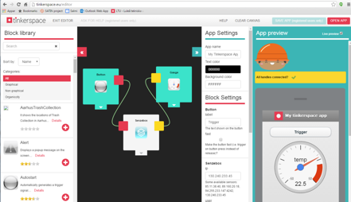
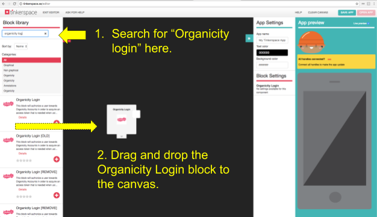
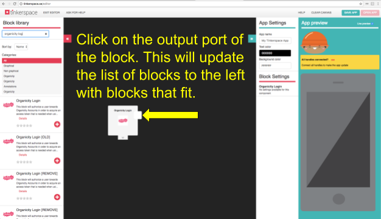
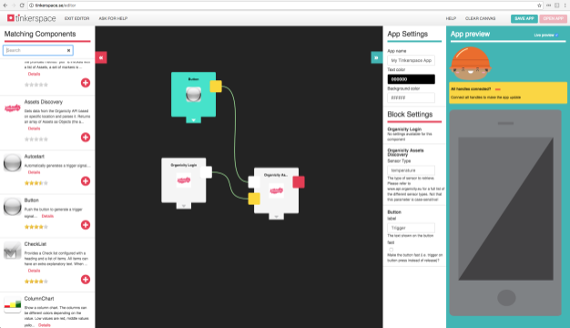
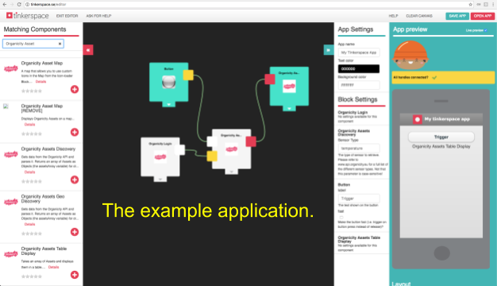
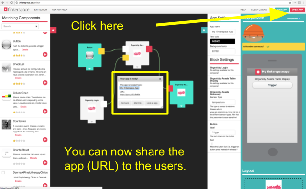
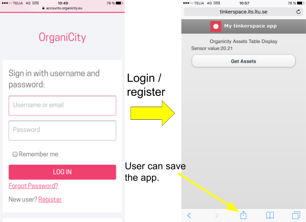
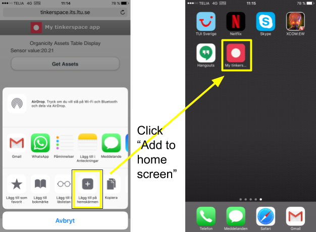

# Tinkerspace | OrganiCity

##Introduction

An increasing amount of people are interested in creating a personalized digital experience, i.e. to be able to select and form the usage of electronic devices to suit their own personal preferences. This might include using unique mobile applications, but not everyone have the technical skills required to develop complex applications. The idea behind Tinkerspace is to provide both technical and non technical citizens with a powerful graphical editor tool that enables them to transform their ideas into mobile applications. 

Within the OrganiCity facility, Tinkerspace offers the following functionality: 

*	Enables end-users to quickly **build** a mobile web application based on a set of ready-made building blocks with smart city and the open data access
*	Enables experimenters to develop specific building blocks tailor-made for their experiment. These blocks can then be built into powerful mobile web applications to be used by end-users, or can 
	be made available for end-users co-creation

Tinkerspace is available at [Tinkerspace](http://www.tinkerspace.eu) .


###Functionalities and features

Tinkerspace uses the notion of **_blocks_** much like in a LEGO™ fashion. Users can connect existing blocks in the graphical editor in order to create applications without the need for programming. When a user makes connections between blocks, the result will show in a preview screen indicating the final smartphone appearance in real time. When the user is satisfied, the application can be shared by sending the URL of the web application to others. The link to the web application may be saved in the home screen of most mobile devices, giving a similar appearance as a downloaded app. The web applications are platform independent so they work on all modern smart phones.

For Tinkerspace users who know Javascript programming, it is possible to create their own blocks. This opens up the possibility for creating a vast amount of different applications using the platform. It is also possible for programmers to share their created blocks with other users, which makes the library of blocks being constantly extended. Moreover, it is also possible for the creator of a block to let other developers see the code and connections of a block and **_remix_** this to fit their own needs.

###Implementation

A few blocks in the Tinkerspace platform have been created for interacting with the OC Platform. These serve as a starting point for experimenters to get up and running with OC Experiments and data quickly. The Tinkerspace OrganiCity-specific blocks use the following OrganiCity Components:

*	The OC Accounts for performing authorization
*	The OC Experimenter Portal where the experimenter sets up their experiment and retrieves the experimenter ID and the experiment ID
*	The OC Asset Discovery Service for retrieving OC Assets
*	The OrganiCity-specific blocks are basically generic example blocks that can be used for authorization, retrieving and creating assets. All these blocks are **remixable** so that  experimenters can view examples of how to communicate with the OC Platform and then, if necessary, modify these to fit their needs.


##Creating new apps using Tinkerspace

The main part of Tinkerspace that the user interacts with is the **editor**, which consists of three major parts:

*	The Block Library
*	The Canvas
*	The App Settings and Preview area

The **Block Library** contains a set of building blocks such as **Button**, which is used to trigger events; **My Location**, which reads the smartphone; **Map**, which displays information on a map, etc. The **Block Library** and **App Settings and Preview area** can be collapsed to allow more screen area for the canvas, which can be useful when arranging blocks into an app.



**Figure 1\.** Tinkerspace user interface

The figure shows a simple example where three blocks are combined into an app, allowing us to read a remote temperature sensor and to display the value on a gauge when pressing a trigger button. The **Senzebox** block reads the sensor value at an IP address, entered in the settings field. The **Gauge** block displays the value coming from the Senzebox, and the **Button** block provides a trigger to read the temperature. Some settings are available, e.g. the background colour, the text for the button, the IP address for the sensor, etc. Not all settings are shown in the figure.
As it can be seen in the Figure 2, a Tinkerspace block may have input(s) and output(s) and will perform some functionality. The inputs and outputs are colour-coded in order to simplify selecting suitable blocks to connect with. Blocks are connected by **dragging** the coloured box of the output to the corresponding socket of the input in another block. While it may look so, it is not possible to **puzzle** together the blocks as in a jigsaw puzzle.


**Figure 2\.** Creating new apps using Tinkerspace

When the blocks are connected using the colour-coded connectors, the result is shown in the **App preview** part of the screen indicating the appearance of the final smartphone web app in real time. When the experimenter is satisfied with the result, the app is given a name and saved, and the URL of the web app is then e-mailed to the phone. The app may also be shared with others. On the mobile device, the link to the web app may be saved in the home screen, giving a similar appearance to a native mobile app.

##Creating Tinkerspace blocks

Tinkerspace also enables users to create their own blocks, for private use or for sharing with others. This requires experience with Javascript development. JavaScript (JS) has been chosen as the implementation language for TinkerSpace components. The reason is relatively good performance of JS engines in modern WebKit-based browsers in mobile devices, combined with platform independence offered by this solution (it should work on both iOS and Android).

The quickest way to get started would be to login to tinkerspace, enter the **Blocks** section, and start experimenting. Some blocks are marked **remixable** indicating that they can be copied and adapted by other developers.


**Figure 3\.** Tinkerspace menu

The workflow of creating a component is as follows: 

*	Configure the component parameters
*	Write the JavaScript of the component
*	Submit the component into the Tinkerspace system

To write the javascript code of one component, a constructor function named **make_[componentname]** must be defined. This function can be invoked multiple times to create separate instances of the component, each encapsulating its own state variables. The constructor function must return a struct with a number of functions provided by the component (this struct may be empty, which would be the case for certain GUI components that accept no input from other components) 

Example:
```
function make_TriggerButton (label, id, env) {
   var button = document.getElementById(id);
   button.setAttribute("value",label);
   button.onclick = function () { env.trigger() };
}
```

The graphical user interface in the TinkerSpace editor uses an abstraction where a component has inputs and outputs. To this end, the following mapping is used: 

*	Input = Provided Push 
*	Input = Required Pull 
*	Output = Provided Pull 
*	Output = Required Push
*	Provided interface

A provided interface has zero or more ports. In javascript, it is implemented as a struct whose selectors are functions in this component that can be invoked by other components. If the component provides any functions, the constructor function must return a struct with selectors whose order, names, kinds, and types correspond to the provided ports of the component . Example:

```
function make_Counter (start_value, id, env) 
{    
    var value = start_value;    
    return { 
    	inc : function (increment) { value = value + increment; },       
     	get : function () { return value ; }    
    } 
}
```

A required interface has zero or more ports. In javascript, it is implemented as a struct whose selectors are references to functions from other components that this component may invoke. The following example shows a constructor with these two parameters:

```
function make_Sum(id , env) {    
    return {        
        sum: function () { 
        	x = env.requiredMethodA();
        	y = env.requiredMethodB();            
    		return x+y;
    	}    
    } 
}
```

The selectors in the env struct, **requiredMethodA** and **requiredMethodB**, have to be listed in the Configuration Gui  as required ports. These names are local to this component, i.e., the names of the required ports in this component need not coincide with the names of the provided ports in the components that they are connected to.

The provided and required interfaces contain zero or more ports. A port is either push or pull: 

*	Push: Functions that do not return a value. Can be executed either immediately when they are invoked, which is the default behavior, or at a later point in time, if they are wrapped in window:setTimeout() at the point of invocation; in this way a component may also schedule itself to execute after a certain period of time. 
*	Pull: Functions that always return a value. Must be executed immediately upon invocation. In both cases, the functions provided and required by a component can take at most one argument (but this argument may be a struct).

A problem of JavaScript that has to be overcome in the TinkerSpace architecture is the fact that a JS program is not normally allowed to communicate with a web site other than where it is deployed (Java Same Origin Policy). In order to solve this, Tinkerspace solution provides a proxy server. Use the special function **_satinExternalCall()** to set up an asynchronous POST or GET service call and pass the result to a callback function.

```
_satinExternalCall(processResponse, curl, callT)
// processResponse: Callback function
// curl: Url for the call
// callT: "GET" or "POST"
```

Example of proxy call:

```
function myFunction() {
    lat = 65.583057;
    lon = 22.146142;
    var url = "http://api.yr.no/weatherapi/locationforecast/1.8/" + "?lat=" + lat + "&lon=" + lon;
    _satinExternalCall(processResponse, url, "GET");
 }
```

Example of callback function:

```
function processResponse(response) {
   satinlog.print(response.responseText); //debug
       
   if (!response.error && response.status == "200" && response.responseText.length > 0) {
       // Do something with the response 
   }
}
```

##Organicity specific Blocks in Tinkerspace

This section focus on how to use some of the OrganiCity-specific blocks.

There are currently 4 OrganiCity-specific blocks:

*	OrganiCity Login
*	OrganiCity Asset Discovery
*	OrganiCity Assets Table Display
*	OrganiCity Asset Creator

The functionality of each block is described briefly, followed by an end-to-end example of how to create an OrganiCity-related application using these blocks.

####OrganiCity Login

The OrganiCity Login block provides a starting point for creating OrganiCity-related applications. This block will log in users to their OrganiCity account using the OAuth 2.0 [Oauth2] authorization process. When a user has logged in successfully, the block will trigger the **Login Complete** output that can be used to start other blocks.

####OrganiCity Asset Discovery

The OrganiCity Asset Discovery block is an example block that shows how to retrieve data from the Asset Discovery API. The block needs a **Login Complete** input to ensure the users are  authorized (typically issued via the OrganiCity Login block). The block is then started by activating its **trigger** input by for example the Button block. Once started, this block will make a call to the API querying for a list of Assets based on a sensor type that the user specifies in the block configuration. Once it has received this data (in JSON format) from the API, it will push this to its output for other blocks to use. This block has no graphical components.

####OrganiCity Assets Table Display

This block provides an easy-to-understand example of how API output from the OrganiCity Asset Discovery block can be parsed and displayed. The block will start parsing the JSON data as soon as it is provided to its input terminal. This block holds a simple graphical component, an HTML-table, that will be updated with sensor values from the API call in the OrganiCity Asset Discovery.


##Organicity Example application

Using the above mentioned components we can build an OrganiCity example application that

*	Makes sure the user is authorized
*	Retrieves a list of Assets from the OC Asset Discovery API based on a sensor type
*	Displays the results in a table

To create this application, first login to Tinkerspace and choose **Create new app!**. Then use the search field in the top left corner to look for the OrganiCity Login block (Figure 4).



**Figure 4\.** Search for the Organicity Login block and drag it onto the Canvas (black area)

Now this block’s output needs to be connected to some other block. To do this, click on the output terminal of this block in order to automatically search for blocks that fit with this one (Figure 5).



**Figure 5\.** By clicking ports on blocks the list of blocks on the left will automatically be updated with blocks that fit the selected input or output port

In our example we will choose to connect the OrganiCity Asset Discovery block that provides a way to search for Assets within the OC Platform. Drag and drop this onto the canvas, and then connect the OrganiCity Login block output to the corresponding input on the OrganiCity Asset Discovery block (Figure 6).


**Figure 6\.** Add blocks to your applciation by using drag and drop

Now click the **Trigger** input of the OrganiCity Asset Discovery block in order to find triggers that can operate together with this block (in the same manner as in Figure 5). Find the **Button** block in the left menu and drag-and-drop this onto the canvas. Now connect the ports between these three blocks. When completed it should look like in Figure 7.



**Figure 7\.** The three blocks (Organicity Login, Button and Organicity Asset Discovery) connected

Finally, connect the output port of the OC Asset Discovery in order to complete the example application. Click the output terminal to find and connect the OrganiCity Asset Table Display. Now the example application is complete and should look like Figure 8.



**Figure 8\.** The finished example application

The preview window on the right should show that all handles are connected. You should also see a preview of the application. The application is now finished and you can share it with users by sending the link (URL) for the application (Figure 9).



**Figure 9\.** Sahre your application by sending its URL

When users open OrganiCity applications, they will be first asked to login to their OrganiCity Account. If they do not have one already, there is a link to create an account. When users have logged in successfully, the application will open automatically (Figure 10).



**Figure 10\.** Users first need to login in order to use Organicity applications

It is also possible for users to save applications to their home screen. This procedure is described for iPhone in Figures 10 and 11, but this works on Android phones as well in a similar manner. When users have chosen to save the application to their homescreen, it will appear as a **native** application among their other installed apps (Figure 11).



**Figure 11\.** An OrganiCity application can be made to look as a *native application* by saving it to the home screen

##CONCLUSION

Tinkerspace is a graphical programming environment that works by connecting blocks in a LEGO™ fashion. The platform makes it possible for both non-programmers and programmers  to quickly build applications for working with OrganiCity projects. There are several example blocks available that help experimenters connect to the OrganiCity Platform. It is also possible for experimenters to create their own blocks using Javascript/HTML, or to **remix** existing blocks in order to see their source code and configurations. These things together makes Tinkerspace a powerful tool for OrganiCity experimenters.

For more detailed information about how to create blocks, please refer to: [Tinkerspace-LTU](http://tinkerspace.its.ltu.se/wiki)
